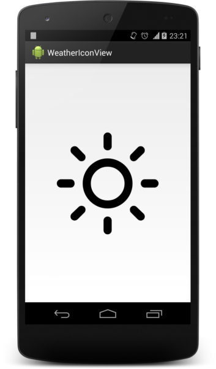

Weather Icon View
===============================

[](https://android-arsenal.com/details/1/1393) [](https://travis-ci.org/pwittchen/WeatherIconView) 

Android library providing custom view for displaying weather icon. 

Weather Icon View is based on [Weather Icons](https://github.com/erikflowers/weather-icons/) project by [Erik Flowers](https://github.com/erikflowers).

Contents
--------
- [Usage](#usage)
  - [In XML layout](#in-xml-layout)
  - [In Java code](#in-java-code)
- [Icons reference](#icons-reference)
- [Example](#example)
- [Screenshot](#screenshot)
- [Download](#download)
- [Who is using this library?](#who-is-using-this-library)
- [References](#references) 
- [License](#license)

Usage
-----

### In XML Layout

```xml
<com.github.pwittchen.weathericonview.WeatherIconView
    android:id="@+id/my_weather_icon"
    android:layout_width="wrap_content"
    android:layout_height="wrap_content"
    custom:weatherIconResource="@string/wi_day_sunny_overcast"
    custom:weatherIconColor="@android:color/black"
    custom:weatherIconSize="100" />
```

### In Java code

```java
WeatherIconView weatherIconView;
weatherIconView = (WeatherIconView) findViewById(R.id.my_weather_icon);
weatherIconView.setIconResource(getString(R.string.wi_day_sunny_overcast));
weatherIconView.setIconSize(100);
weatherIconView.setIconColor(Color.BLACK);
```

Icons reference
---------------

Icons reference is available at: http://erikflowers.github.io/weather-icons/

In Weather Icon View for Android, dashes (-) are replaced with underscores (_), but names of the icons are the same.

Example
-------

Example presenting, how to use this library is provided in `app` directory of this repository.

Screenshot
----------



Download
--------

You can depend on the library through Maven:

```xml
<dependency>
    <groupId>com.github.pwittchen</groupId>
    <artifactId>weathericonview</artifactId>
    <version>1.1.0</version>
</dependency>
```

or through Gradle:

```groovy
dependencies {
  compile 'com.github.pwittchen:weathericonview:1.1.0'
}
```

Who is using this library?
--------------------------

- [Helsinki Testbed Viewer 2.0](https://play.google.com/store/apps/details?id=fi.testbed2)
- [Weather for Android](https://play.google.com/store/apps/details?id=com.github.handioq.weatherapp)
- [Sluhy - Počasí](https://play.google.com/store/apps/details?id=cz.dzoukr.sluhyweather)
- [SpaceLaunchNow](https://github.com/caman9119/SpaceLaunchNow)
- and more...

Are you using this library in your app and want to be listed here? Send me a Pull Request or an e-mail to piotr@wittchen.io

References
----------
- [Original weather-icons project](https://github.com/erikflowers/weather-icons/)
- [SkyIcons - similar project for Android, but with animations](https://github.com/torryharris/Skycons)
- [weather-icons usage in JavaScript application](https://gist.github.com/tbranyen/62d974681dea8ee0caa1)

License
-------

    Copyright 2015 Piotr Wittchen

    Licensed under the Apache License, Version 2.0 (the "License");
    you may not use this file except in compliance with the License.
    You may obtain a copy of the License at

       http://www.apache.org/licenses/LICENSE-2.0

    Unless required by applicable law or agreed to in writing, software
    distributed under the License is distributed on an "AS IS" BASIS,
    WITHOUT WARRANTIES OR CONDITIONS OF ANY KIND, either express or implied.
    See the License for the specific language governing permissions and
    limitations under the License.
